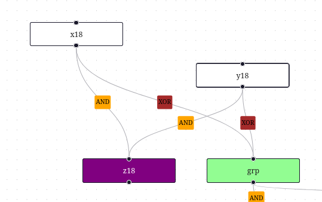
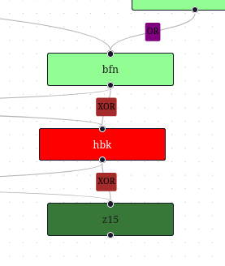
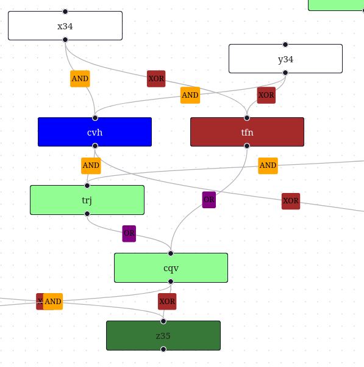

# 24b

Conditions for swapped wire:

## 1. Output gate starts with z but operator is not XOR

Gate z18 has operator AND instead of XOR

## 2. XOR into/from non 'xyz' gate

Gate hbk gets input from XOR by bfn and dfb

## 3. / 4. AND into AND / XOR into OR

x34 + y34 AND into cvh, but cvh ANDs into trj

x34 + y34 XOR into tfn, but tfn ORs into cvq
